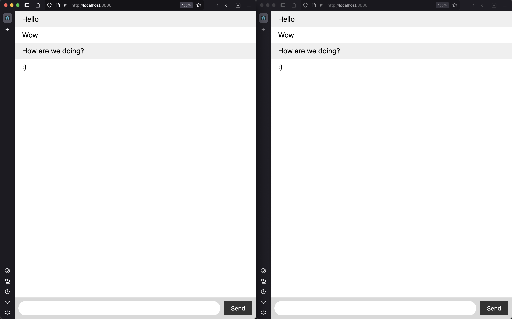

# Simple Socket.IO Chat App

A basic real-time chat application built using **Node.js**, **Express**, and **Socket.IO** created while to learn Socket.IO.

## 🚀 Features

- Real-time messaging between users
- Messages broadcasted to all connected clients
- Clean and responsive UI

## 📖 Learning Source

This chat app was built by following the [Socket.IO official tutorial](https://socket.io/docs/v4/tutorial/introduction).

## 📁 Project Structure

```text
simple-socketio-chat/
│
├── public/
│ └── index.html
├── app.js
├── package.json
└── README.md
```

## 🛠️ How to Run

1. Clone the repository:

   ```bash
   git clone https://github.com/asim-p/simple-socketio-chat.git
   cd simple-socketio-chat
    ```
2. Install dependencies:

    ```bash
    npm install
3. Start the server:

    ```bash
    node app.js
4. Open your browser and go to:

    ```arduino
    http://localhost:3000

Open in multiple tabs or browsers to see real-time communication be broadcasted to various clients(users).

## 📦 Dependencies

- express
- socket.io

## 📸 Preview


